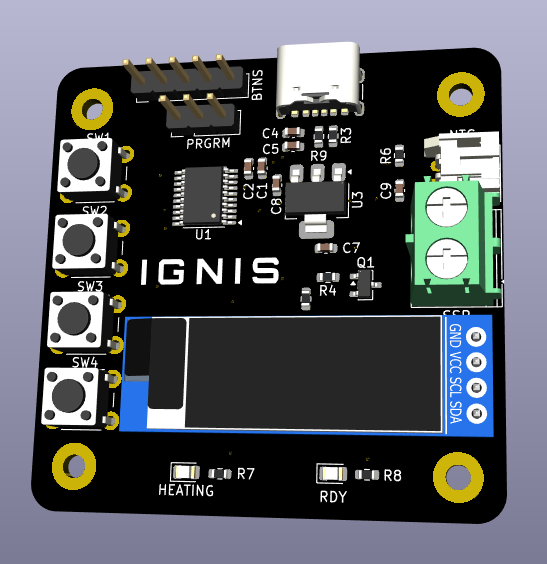
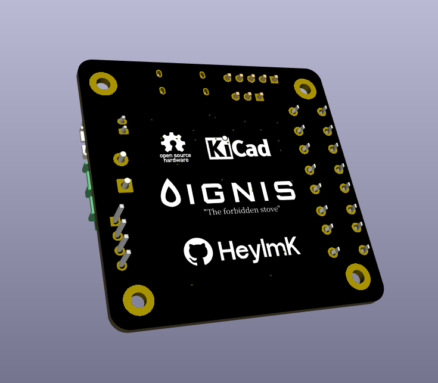
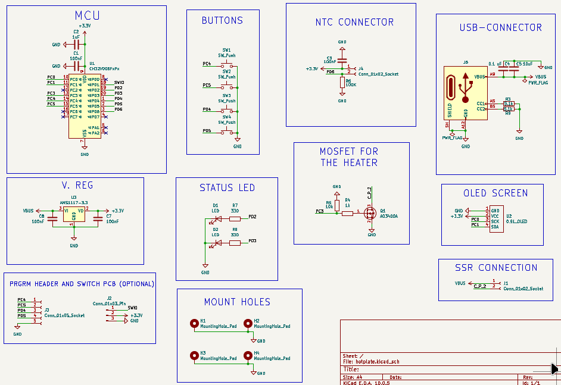
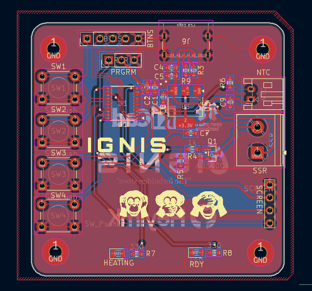
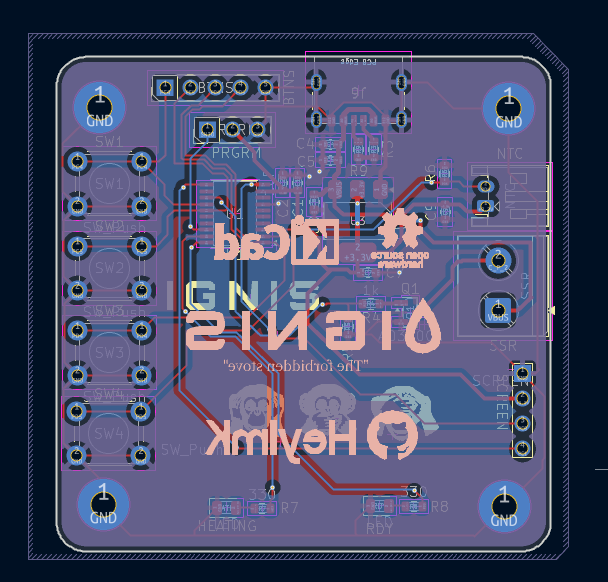

# Ignis
A low-voltage controller board for driving a 220V 400W aluminum PTC heater via an external SSR, it has a NTC for temperature readings, an OLED status/info display, and MOSFET-isolated relay stuff. The board uses the CH32V006F8P6 MCU, its mainly used for triggering the SSR and reading temps,it keeps all mains voltage completely off of the board.
## Pictures
| Top View | Bottom View |
| :---: | :---: |
|  |  |
## Features
* **Main Controller:** CH32V006F8P6,62KB Flash and 8KB RAM.
* **USB-C Power:** Board is powered over USB-C.
* **No High Voltage:** The PCB handles 5V/3.3V logic. The 220V AC mains load is kept off-board and switched safely via a external SSR.
* **Precision Sensing:** It uses a 100K NTC thermistor it can read up to 300°C.
* **OLED Interface:** I2C header for a 0.91" SSD1306 OLED displaying target temps, current temp, and heating status.
* **Status LEDs:** Inbuilt HEATING and RDY LEDs gives the heater state without needing a screen.
* **Button Header:** 5-pin header breaking out 4 tactile buttons for menu navigation.
## Components Used
* **Microcontroller:** WCH CH32V006F8P6 (TSSOP-20)
* **Power Input:** USB-C receptacle (power-only)
* **High Voltage Switch:** External SSR connected via terminal block
* **Heater:** 220V 400W PTC Aluminum Heating Plate
* **Thermistor:** 100K NTC connected via a JST-PH 2-pin connector
* **Screen:** 0.91" SSD1306 I2C OLED Module
* **Miscellaneous:** AMS1117-3.3V Regulator, AO3400A MOSFET, 4x tactile buttons, 2x status LEDs, and assorted 0603 passives.

## Bill of Materials (BOM)

| Qty | Component | Footprint | Designator(s) | Purchase Link | Price (Rs) |
| :---: | :--- | :--- | :--- | :--- | :--- |
| 1 | Conn_01x05_Socket (Buttons Header) | PinHeader_1x05_P2.54mm_Vertical | BTNS | N/A (any 2.54) | 0 (Already have) |
| 5 | 100nF Capacitor | C_0603_1608Metric | C1, C7, C8, C9, C4| [Link](https://www.google.com/aclk?sa=L&ai=DChsSEwjWubzfq_KWAxVioWwJHVqjE8wYACICCAEQExoCc2Y&co=1&gclid=CjwKCAjw2aPVBhBkEiwA0CpttxyZiuBTF60ARCzRlQv1wOvQn9Ln7Phh8AjBaM22zXAcPF-IAOMuhRoCiZ0QAvD_BwE&cid=CAAS9gHkaA9Mi-UPaGql0S6myvb2LanWs_hoczlRaLo8LdECcTfFA-W8eqSXpiu2Puml42bIa7v_HBw9_mI6NEkx9i0myCsUGftX24P3-UCmkTGwZrFsU0BwJ8dCOHYs8yvsxjpRQwjH_uvNDexOgG1wUDAQ0P-BJZl5-3Fow6dQR72VKUfztoA_-oSahlbYac6cqUK1pDvFReuEzmJMf88bpsotwaCjw0tTJoldDmuYUl_IsLorsIGnkdDTMLrtQRREB7B4yb7gziSToLH-9Onh54hlrXd5ChQYjjWFkbAuXQqNCxhsV-wsj35o-l13hoZH_t-N_gCMRv8&cce=2&sig=AOD64_08o8edncOKI5-4DwoIfZhybAqDPQ&ctype=5&q=&ved=2ahUKEwiRtrffq_KWAxWikuEIHdGiJzYQ5bgDKAB6BAgNEAs&adurl=) | 0 (Already have) |
| 1 | 1µF Capacitor | C_0603_1608Metric | C2 | [Link](https://robu.in/product/1uf-1000nf-50v-capacitor-0603-smd-package-pack-of-20/?gad_source=1&gad_campaignid=17427802703&gclid=CjwKCAjw2aPVBhBkEiwA0Cptt-klC8yW7VcnOm1oQzstlq8__qPEDX5lBedVzGTdGvl9aioaYdJKhBoCE5oQAvD_BwE) | 11.00 |
| 1 | 10µF Capacitor | C_0603_1608Metric | C5 | [Link](https://robu.in/product/cl10a106ma8nrnc-samsang-25v-10uf-x5r-%C2%B120-0603-multilayer-ceramic-capacitors-mlcc-smd-smt-rohs/?gad_source=1&gad_campaignid=20387462343&gclid=CjwKCAjw2aPVBhBkEiwA0Cptt_jrdtTLjbGVqE7j4SUPV9jsXRgV3px3erPD96kSMqSafKEsVnAZuRoCdTsQAvD_BwE) | 20.00 |
| 2 | LED (Heating / Ready) | LED_0805_2012Metric | HEATING, RDY | N/A (any 0805) | 0 (Already have) |
| 1 | USB-C Receptacle (Power Only) | USB4125-xx-x 6P TopMnt Horizontal | J6 | [Link](https://www.ktron.in/product/6-pin-usb-type-c-connector-smd/?srsltid=AU7gw4WCxG2g2oUNClt9s5qOYEoZTqFwBmndH3bq_uDZghMpFEObVLpm) | 15.00 |
| 1 | Conn_01x02_Socket (NTC) | JST_PH_S2B-PH-K_1x02_P2.00mm_Horizontal | NTC | [Link](https://robu.in/product/ph-aw-2mm-2-pin-wafer-male-connector-through-hole-right-angle/?gad_source=1&gad_campaignid=17427802703&gclid=CjwKCAjw2aPVBhBkEiwA0Cpttx-oBttgFg3lpMmzYvOTe5D44ZijZ2riTrUj3DSICNVzOlxnziOd7xoCIt0QAvD_BwE) | 0 (Already have) |
| 1 | JST-PH 2.0 Female Connector | N/A (Off-board wire harness) | — | [Link](https://hubtronics.in/1508?srsltid=AU7gw4Wmjln1E9tSbj1yLX3e6CGLNVZjP4-da3Qo7EFz9MvRA4VvwUHm) | 5.00 |
| 1 | Conn_01x03_Pin (Programming Header) | PinHeader_1x03_P2.54mm_Vertical | PRGRM | N/A (any 2.54) | 0 (Already have) |
| 1 | AO3400A N-Channel MOSFET | SOT-23 | Q1 | [Link](https://robu.in/product/ao3400-xblw-30v-5-8a-34m%cf%894-5v5a-1-4w-700mv250ua-1-n-channel-sot-23-3l-mosfets-rohs/) | 18.00 |
| 2 | 5.1kΩ Resistor | R_0603_1608Metric | R3, R9 | [Link](https://www.etstore.in/products/g7551?variant=46786456977659&country=IN&currency=INR&utm_medium=product_sync&utm_source=google&utm_content=sag_organic&utm_campaign=sag_organic&srsltid=AfmBOooAEYspNoTwyRh231GTfDzfoce41MVHsCR0qa07n6oFZs1zyCXtE4U) | 0 (Already have) |
| 1 | 1kΩ Resistor | R_0603_1608Metric | R4 | [Link](https://robu.in/product/1k-ohm-1-4w-0603-surface-mount-chip-resistor-pack-of-100/) | 10.15 |
| 1 | 10kΩ Resistor | R_0603_1608Metric | R5 | [Link](https://robu.in/product/10k-ohm-1-4w-0603-surface-mount-chip-resistor-pack-of-100/?gad_source=1&gad_campaignid=17427802703&gclid=CjwKCAjw2aPVBhBkEiwA0Cptt4oDgB-X0LF9_Wo0jAhzlSL1k49oGO2g-5uIWDAJX2wKff-w9ob-aRoCJvsQAvD_BwE) | 13.00 |
| 1 | 100kΩ Resistor | R_0603_1608Metric | R6 | [Link](https://robu.in/product/100k-ohm-1-4w-0603-surface-mount-chip-resistor-pack-of-100/) | 11.10 |
| 2 | 330Ω Resistor | R_0603_1608Metric | R7, R8 | [Link](https://robu.in/product/rc0603jr-07330rl-yageo-res-thick-film-0603-330-ohm-5-0-1w1-10w-%C2%B1100ppm-c-pad-smd-t-r/?gad_source=1&gad_campaignid=20387462343&gclid=CjwKCAjw2aPVBhBkEiwA0CpttxWKAhasnzZd6GH-hOIGY6Q7Vlr9g6yXAz9JQC7wOcykbgjOqbGy6BoCL8UQAvD_BwE) | 0 (Already have) |
| 1 | 0.91" I2C OLED | Untitled | SCREEN | [Link](https://www.ktron.in/product/0-91-inch-white-color-oled-display-i2c/) | 180.00 |
| 1 | Conn_01x02_Socket (SSR) | TerminalBlock_Phoenix_PT-1,5-2-5.0-H_1x02_P5.00mm_Horizontal | SSR | [Link](https://evelta.com/2-pin-screw-connectors-pcb/?sku=083-Prime-500-2&srsltid=AfmBOooWSOmGwzVSIBziLjGkH-_o1UC5T2c_B3cS1R9dAHhOMnPMw2FzNgQ) | 18.00 |
| 4 | SW_Push (6mm Tactile) | SW_PUSH_6mm | SW1, SW2, SW3, SW4 | [Link](https://robu.in/product/tsd001b06035a03-bzcn-6mm-6mm-50ma-round-button-direct-insert-6mm-350gf-12v-plugin-tactile-switches-rohs/?gad_source=1&gad_campaignid=17416544847&gclid=CjwKCAjw2aPVBhBkEiwA0CpttwqAopAQNE0Bei_-rT2XhkkkH0R7y_S-IDi2DNaC8Dg6daAmqfU6hhoCHdEQAvD_BwE) | 8.00 |
| 1 | CH32V006FxPx MCU | TSSOP-20_4.4x6.5mm_P0.65mm | U1 | [Link](https://www.etstore.in/products/a2668?_pos=1&_psq=ch32v006&_psid=08be7c9a0&_ss=e) | 40.00 |
| 1 | AMS1117-3.3 LDO | SOT-223-3_TabPin2 | U3 | [Link](https://robu.in/product/ams1117-3-3v-1a-sot-223-voltage-regulator-ic-pack-of-5-ics/?gad_source=1&gad_campaignid=17427802703&gclid=CjwKCAjw2aPVBhBkEiwA0Cpttz9w6ddF1XQumYWw6zxxuAcBU4UH7sDdK9DN8iZBH2cauwtZlcoLIxoCt08QAvD_BwE) | 18.00 |
| 1 | 220V 400W PTC Aluminum Heater Plate | N/A (Off-board) | — | [Link](https://hubtronics.in/aluminum-ptc-heating-plate?srsltid=AfmBOoofmvJnxpgYjjD9DPgNBhnGSLNf_ZdR-ngu1UgQvsgmx_wYjow5) | 500.00 |
| 1 | SSR-40 DA Solid State Relay | N/A (Off-board) | — | [Link](https://robu.in/product/dc-ac-ssr-40da-solid-state-relay-module-3-32vdc24-380vac-40a/?gad_source=1&gad_campaignid=17427802703&gclid=CjwKCAjw2aPVBhBkEiwA0Cptt2UdfUGUIJVYDIimHF9UJncTepMdDUKAhNORn_AaWNtUh0izbvHMLhoCZlQQAvD_BwE) | 269.00 |
| 1 | 100K NTC 3950 Thermistor | N/A (Off-board) | — | [Link](https://robu.in/product/thermistor-100k-ntc-1-meter-cable-temperature-sensor/?gad_source=1&gad_campaignid=17427803012&gclid=CjwKCAjw2aPVBhBkEiwA0Cptt76Yj44bFy054WNXM6b__TI9zpSi9M1uR_w4w8og-iXCbKlJB2rq0hoCktkQAvD_BwE) | 42.00 |
| | | | | **Component Total:** | **1178.25 Rs** (12.30$)|

*Note: Shipping and delivery fees across various vendors will add an estimated 100 - 200 Rs to the final cost.*

| Schematic Design |
| :---: |
|  |

| PCB Top Layer Routing | PCB Bottom Layer Routing |
| :---: | :---: |
|  |  |
### Connections
* **Power (USB-C to 3.3V):** 5V via USB-C (J6) and routes to the SSR connector and the AMS1117 V.REG (U3), which powers the MCU, OLED, and thermistor etc.
* **Thermistor Input (NTC):** Connects the 100K NTC between 3.3V and the MCU's ADC pin (PD2).
* **SSR Driver (SSR):** The MCU's PWM pin (PC3) switches the AO3400 Gate (Q1). The MOSFET pulls the negative side of the SSR terminal to GND, triggering the external relay.
* **OLED Header (SCREEN):** Connected to PC1 (SDA) and PC2 (SCK).
* **Button Header (BTNS):** 5-pin header breaking out the 4 tactile switches (SW1–SW4).
* **Programming Header (PRGRM):** Breaks out 3.3V, GND, and the single-wire debug line (PD1 / SWIO) for the programmer.
* **Status LEDs:** HEATING and RDY LEDs (Pin PD2 & PD3)
## License
This hardware project is open-source and licensed under the CERN Open Hardware Licence Version 2 - Strongly Reciprocal (CERN-OHL-S-2.0). 
You are free to copy, modify, distribute, and manufacture this board for personal or commercial use. However, if you modify these schematic or layout files and distribute your new design, you must release those modifications under this exact same CERN-OHL-S-2.0 license.
This design is shared without any warranty or implied guarantee. Check the LICENSE file for the full legal text.
